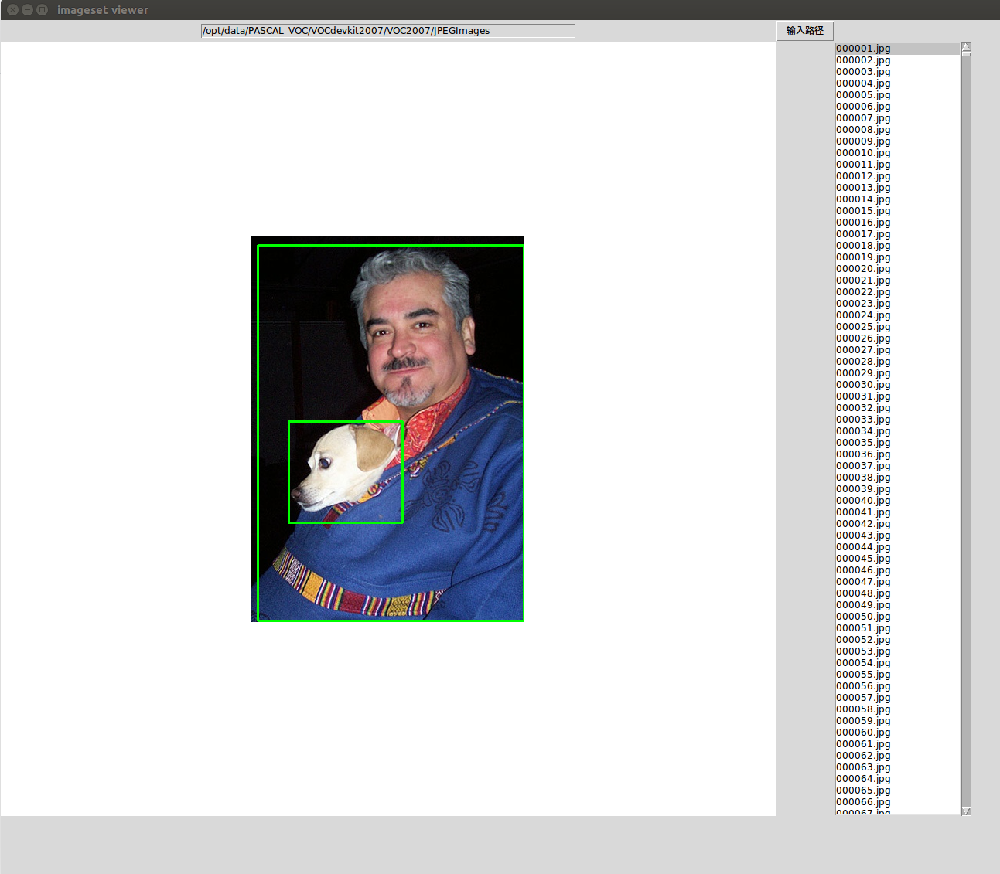

# VOC Annotation Viewer

A GUI, for viewing object detection datasets. Displays single image with bounding boxes (if any). Now only supports PASCAL VOC format. This is a modified fork of Zhuo Zhang's [imageset-viewer](https://github.com/zchrissirhcz/imageset-viewer) with modifications to support alternate VOC style annotations.

## Dependencies

- Python

    Support Python 2 & 3

    Anaconda installed Python is recommended

- Python packages

    `pip install image pillow lxml numpy opencv-python`

- apt packages

    `sudo apt-get install python-imaging-tk` # execute this line if pip can't install image

## Supported Function
- Choosing image folder via button
- Viewing images with annotated bounding boxes via mouse or arrowdown key
- Change box thickness (in code)
- Displaying with specified resizing image height/width (in code)

## Usage
1. Run `imageset-viewer.py`
2. Select directory containing images.
3. Voila!
